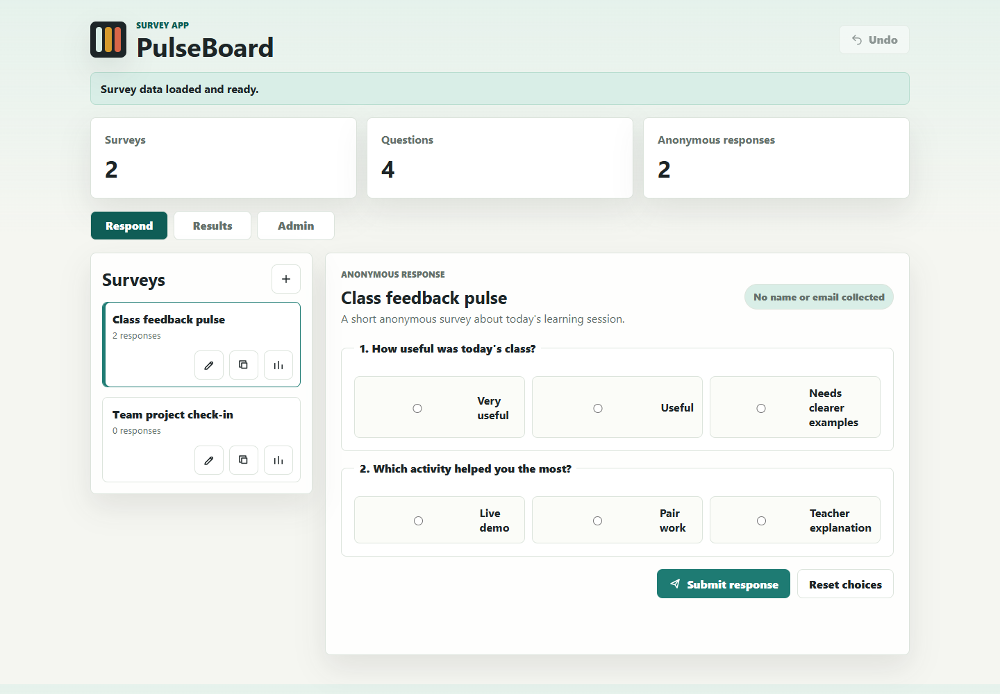
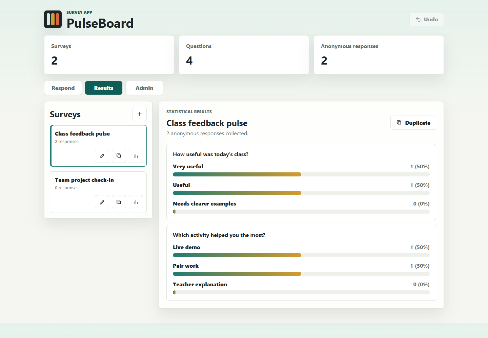
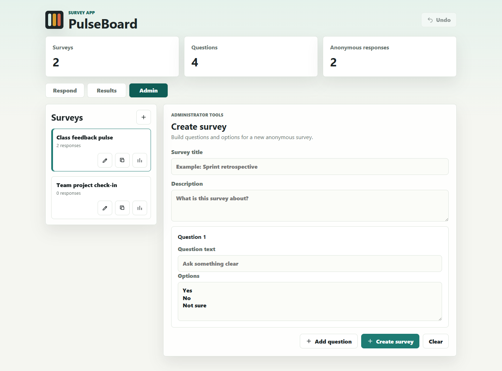
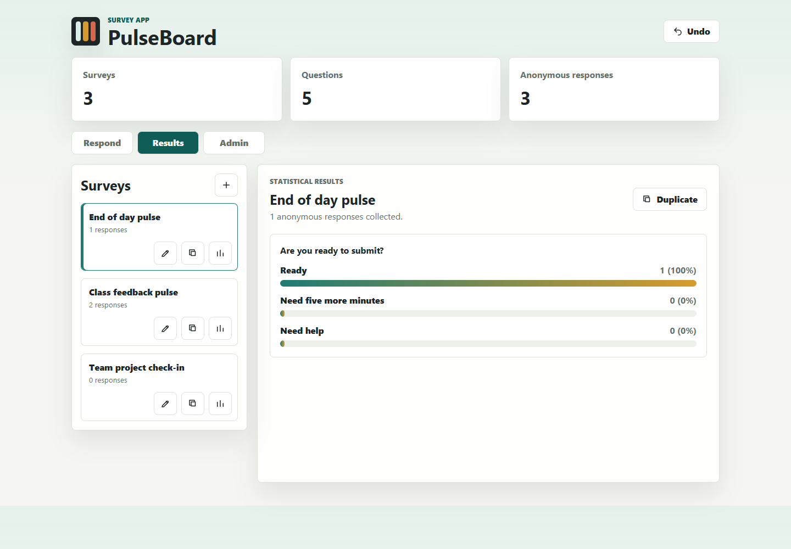
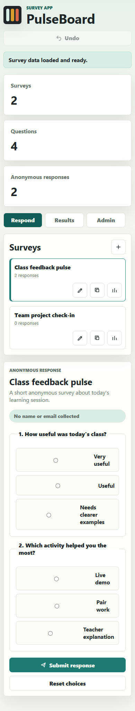

# PulseBoard Survey App

GitHub repository: https://github.com/viictorferre/software-engineering-copilot

PulseBoard is a small survey application built for the Software Engineering Copilot activity. I chose the **Survey App** specification from `UserStories_App_d'Enquestes-ENG.pdf`.

## Selected Functional Requirements

The app covers the four user stories from the chosen specification:

- **US-01:** administrators can create surveys with questions and options.
- **US-02:** users can answer surveys anonymously.
- **US-03:** administrators can duplicate an existing survey and modify the copy.
- **US-04:** users can view statistical results and response trends.

All main actions are available from the main interface, show confirmation messages, support undo, and persist data with `localStorage`.

## Technology

- HTML
- CSS
- JavaScript ES modules
- Browser `localStorage`
- Node test runner for core logic tests

I used plain JavaScript because the brief allowed React, JavaScript, or the technology used in the final project, and this version can run without installing third-party dependencies.

## How To Run

From the repository folder:

```bash
python -m http.server 5173
```

Then open:

```text
http://127.0.0.1:5173
```

## How To Test

```bash
node --test tests/*.test.mjs
```

## Used Prompts

These are the prompts used progressively with Copilot/AI assistance while refining the application:

1. "Read the Survey App user stories and create a simple web app that satisfies the four requirements: create surveys, answer anonymously, duplicate surveys, and view statistics."
2. "Scaffold a clean JavaScript project with an `index.html`, CSS file, and a main JavaScript entry point. Keep it easy to run without a backend."
3. "Add a survey domain module with functions to create surveys from drafts, duplicate surveys, add anonymous responses, calculate statistics, and persist data."
4. "Build the administrator interface so the user can create a survey with a title, description, questions, and multiple options."
5. "Add anonymous response mode. Do not collect name, email, or any personal identifier. Require all questions to be answered before saving."
6. "Add a statistics view with counts and percentages for each answer option, using visual bars."
7. "Add undo support for create, edit, duplicate, and submit response actions. Show a confirmation message after each saved action."
8. "Improve the interface so all workflows are available from the main screen, responsive on mobile, and visually clear for screenshots."
9. "Add unit tests for creation, duplication, anonymous responses, statistics, updating, and persistence."
10. "Write the README with the GitHub link, prompts used, screenshots, and lessons learned."

## Screenshots

### Anonymous Response View



### Results View



### Administrator View



### Created Survey Results



### Mobile View



## Lessons Learned On The Use Of Copilot

- Copilot works better when the prompt includes the exact user stories and acceptance criteria instead of a vague app idea.
- Iterative prompts are more effective than asking for the whole project in one step.
- Asking for one feature at a time made the commits easier to understand and review.
- Copilot can generate useful structure quickly, but the developer still has to verify edge cases such as missing answers, duplicated IDs, and persistence.
- Clear acceptance criteria make it easier to ask Copilot for tests that match the expected behavior.
- Visual verification is still necessary because generated code can be functionally correct but have layout or usability issues.
